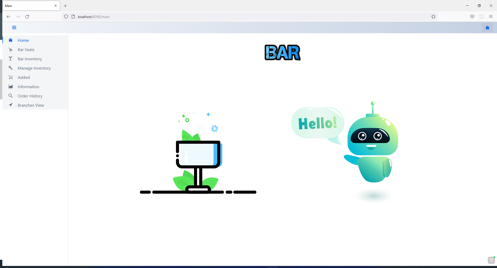
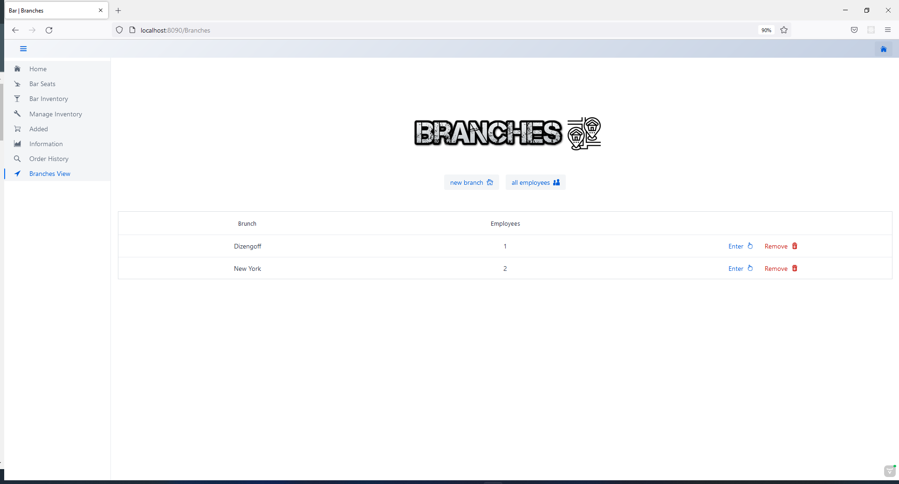
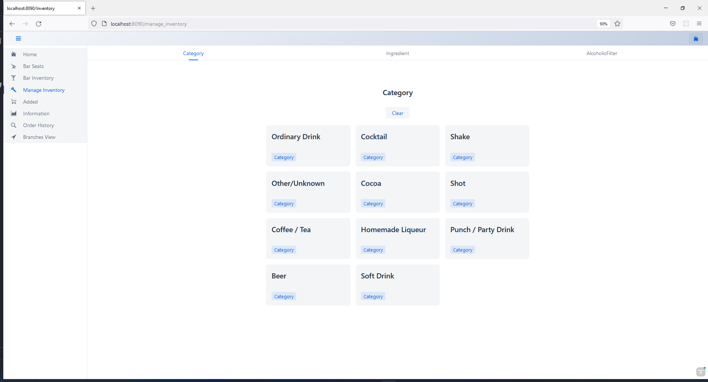
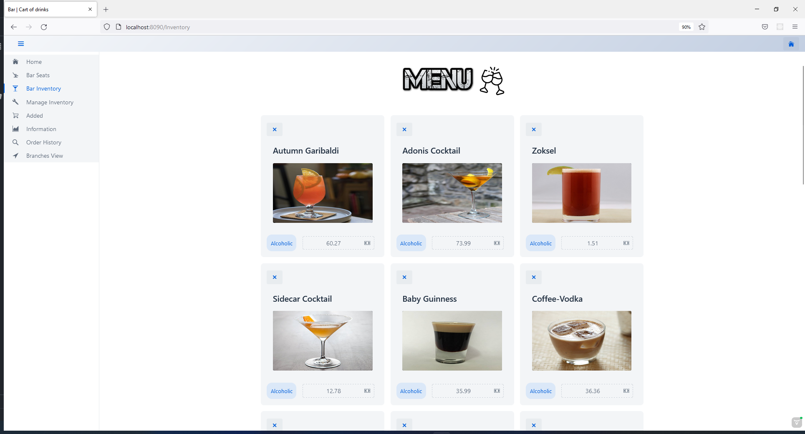
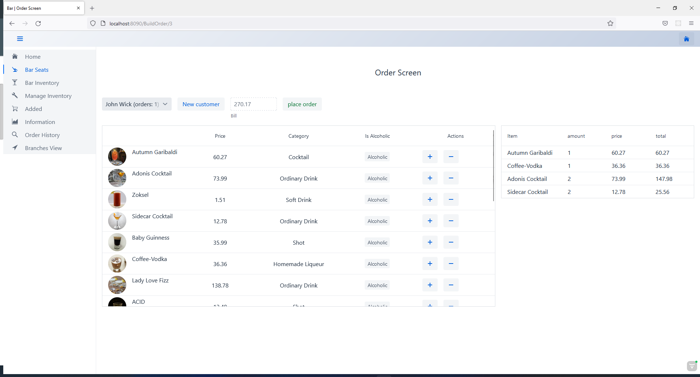
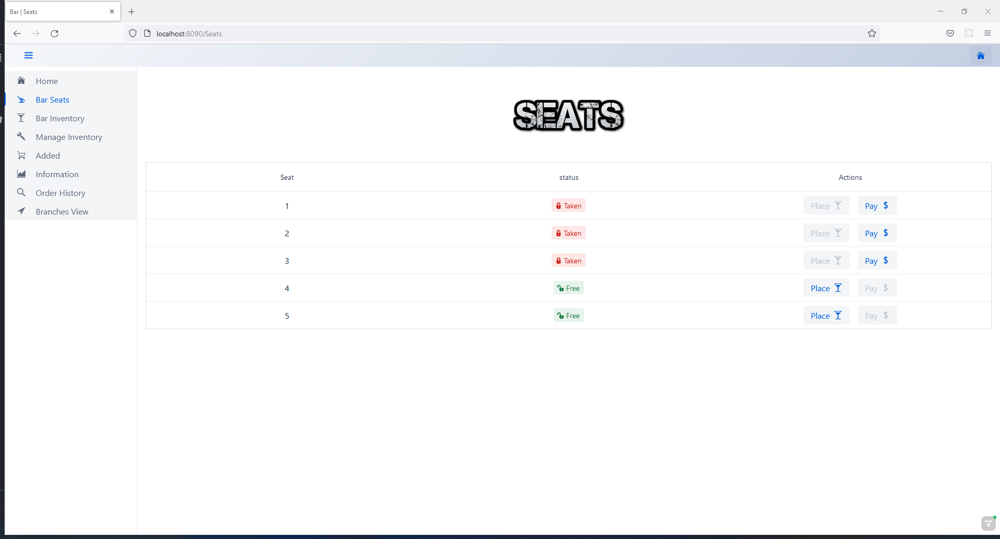
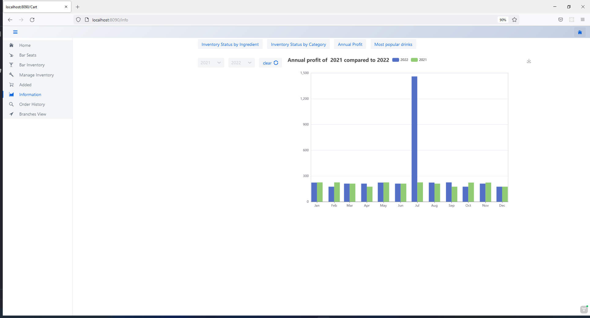

### Bar management  system

------------

This project is a final project in a server-side development course via  spring boot.

------------

### Description
- Full Stack Bar Management System which is capable to manage over 400 drinks at once.
-  Uses external API of drinks and cocktails which simulates commercial supplier activity.
- Simulates a bartender work.
- Enables administrative and logistical work.

# Structure
	Server side - Spring boot server
	DB  - MongoDB
	Client -  Vaadin framework 

####  Main concepts:
	MVC architecture
	Asynchronous work.
	design patterns –  singleton, factory.
	RESTful web server.
	services.

  ### Functionality 
	- Creating bar menu by an external inventory of drinks (adding, removing  and updating prices)
	- Managing customers orders  - taking orders form customer, taking payment.
	- Employees Management – Bartender can work in many branches  - many to many
	- Branches Management – create, remove & update branch, add & remove barman from branch 
	- Drink & cocktails inventory management
	- Generating statistical reports 

### [Back End](https://github.com/Alzoke/barmanager "Back End")

### Images

